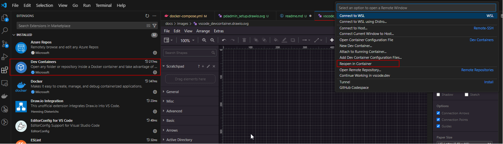
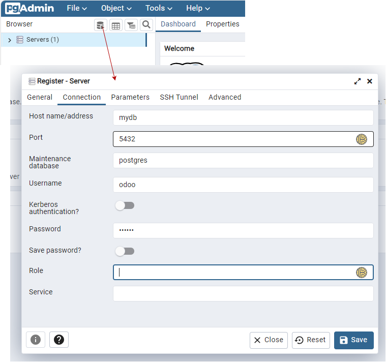

# Development Environment

This repository is a deveopment enviorment for Odoo compleatly hosted in a local docker setup. 

In order to checkout private repositories, your github private key needs to be setup on the host maschine in your user **./ssh** folder:

There need to be two files in this folder. One configuration file named [**config**](./setup/ssh/config) and the private key file **id_rsa**.

To run the development environment you need a local docker installation. Start the root folder in your local vscode (plugin **Dev Containers** required) and select **Reopen in Container**.

## odoo web
This container runns a [odoo web applicaion](http://localhost:8069).

## odoo dev

This contianer is used to execute the unit tests in vscode. When you execute unit tests in vscode, the first output on the console is a command, when executed on the docker command line you can use the **Python: Tests Debug** profile to connect

When starting the debugger detached, a second webserver is started on port 8067 [odoo web applicaion](http://localhost:8069).

## postgress database

## pgadmin

The pgdadmin provides a [web insterface](http://localhost:8068) to access the postgress database.

Username: **admin@domain.com** \
Password: **admin** 

To connect to the Odoo database you need to create a connection as follow:

name: **mydb** \
username: **odoo** \
password: **myodoo** 

