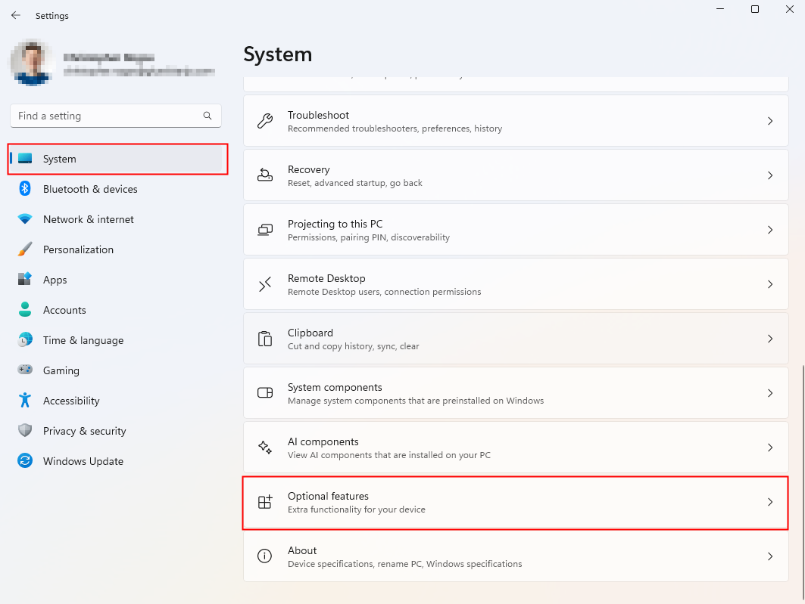
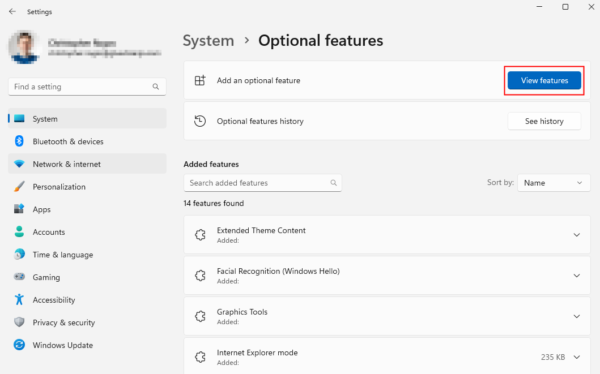
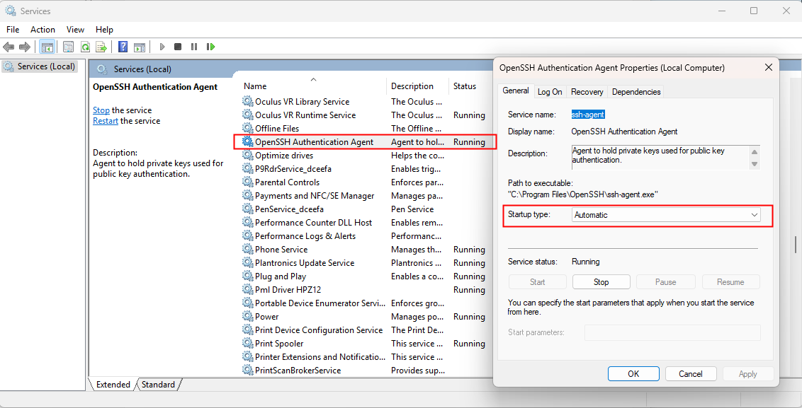
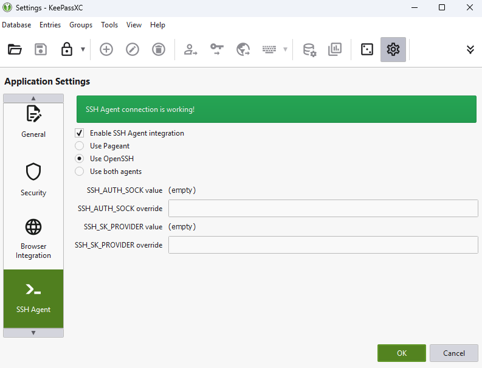
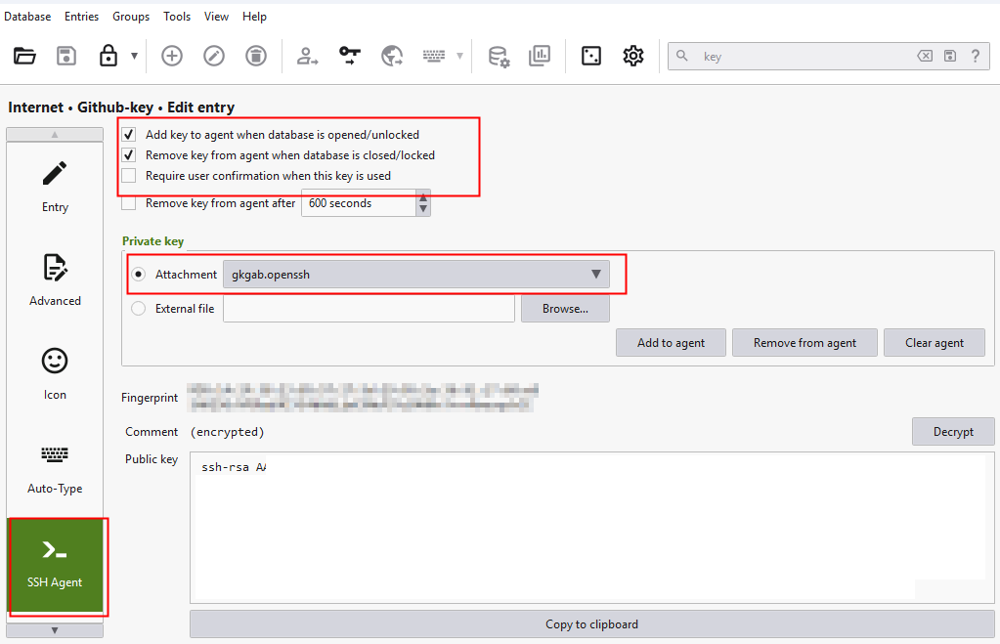
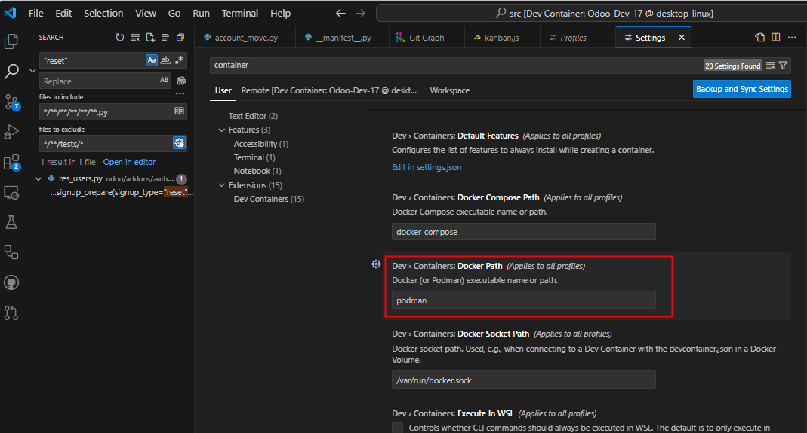

# Development Environment

This repository is a [devcontainer](https://code.visualstudio.com/docs/devcontainers/containers) deveopment enviorment and creates an local hosted Odoo environment.  

In order to checkout private repositories via ssh, your ssh-agent with your ssh key needs to be forwarded into the devcontainer. 

## Setup
To run this development environment you need the following services:
- Podman Desktop
- VSCode
- SSH Agent
There are several ways to host an ssh-agent to work with vscode devcontainers. 
(1) [Keypass 2](https://keepass.info/) with the [ssh-agent plugin](https://keepass.info/plugins.html#keeagent)
(2) Windows OpenSSH agent which could be combined with the [KeyPassXC](https://keepassxc.org/) to add your keys.

### Install the Windows OpenSSH Client
For the second option you need to install the Windows OpenSSH Client using the following steps:

Open the Windows 11 System pannel

Select "Add an optional feature" and install the "OpenSSH Client"

In the last step you need to open the "services.msc" and change the Startup type to automatic.

When everyting is setup correctly, the command shold disply your installed keys:

`ssh-add -l`

### Configure KeyPassXC 

After installation of KeyPassXC, you need to configure the ssh-agent feature.

Now add a new key and upload your existing github ssh-key.

### VSCode

To use devcontainers in vscode, you need to install the "Dev Containers" addon by microsoft.

To use Podman instead of Docker Desktop you need to change the container settings.

## Dev Environment

### odoo test
VSCode will connect into the test container as user odoo and display the /src folder. This contianer is further used to execute the unit tests in vscode. Therefore this container is like the web container a full odoo webserver container. When you execute or debug unit tests via the "Debug Tests" profile in vscode, the first output on the console is the executed command-line to start the tests.

### odoo web
This container runns a [odoo web applicaion](http://localhost:8089).
The first statup fails because the config and source files need to be checked out by the odoo test container first.

### postgress database
The prostgress container operates a postgress database used by the other containers.

### pgadmin

The pgdadmin provides a [web insterface](http://localhost:8088) to access the postgress database.

Username: **admin@odoo.com** \
Password: **admin** 

To connect to the Odoo database you need to create a connection as follow:

name: **mydb** \
username: **odoo** \
password: **myodoo** 

